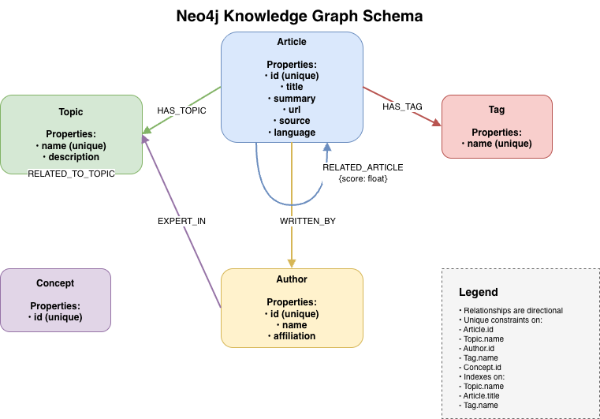
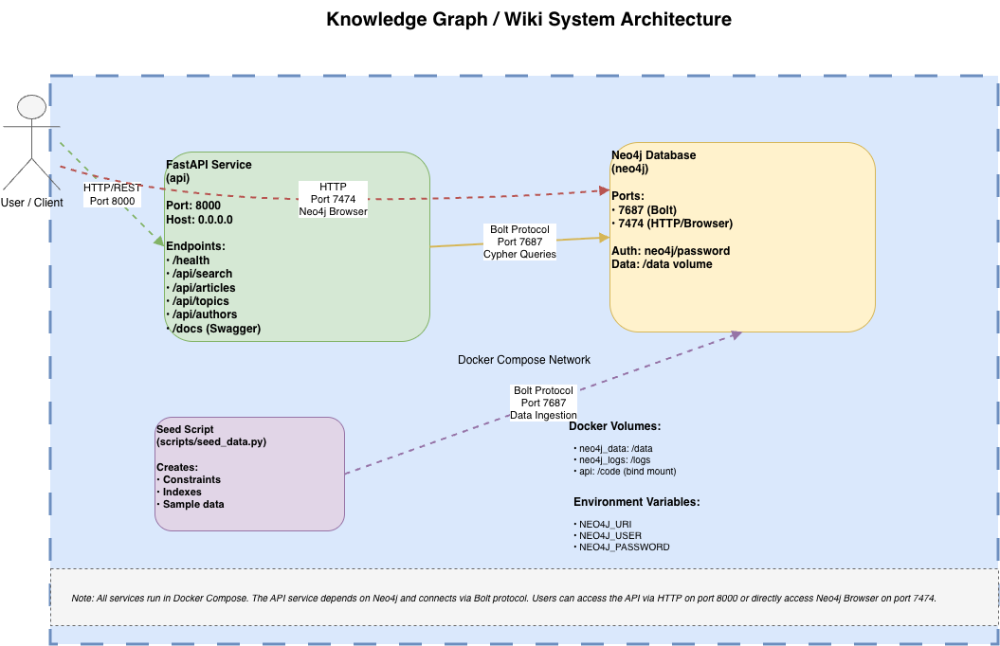

# Knowledge Graph / Wiki System – Projet AIDAMS 3A

Projet réalisé dans le cadre du cours **“Graph Databases & Knowledge Graphs”**.
L’objectif : construire une **API de Knowledge Graph** basée sur **Neo4j** et **FastAPI**, permettant la recherche, l’exploration de sous-graphes, les recommandations d’articles et l’analyse des contributions d’auteurs.

---

## 👥 **Équipe**

* Paul Pascal (team lead)
* Andrea Surace Gomez
* Toscane Cesbron Darnaud

---

# **1. Objectif du projet**

Développer un système de **wiki / knowledge graph** inspiré d’un environnement de documentation interne en entreprise.

Le système doit permettre :

* La **modélisation** d’articles, auteurs, topics, tags et concepts.
* La **navigation** dans un graphe de connaissances.
* La **recherche sémantique** d’articles.
* La **découverte de contenu lié**.
* La **visualisation des contributions** des auteurs.
* L’exposition d’une API REST propre via **FastAPI**.

Ce projet utilise :

* **Neo4j 5.x** (base de graph orientée relations)
* **Python 3.11**
* **FastAPI** (endpoints REST)
* **Docker / docker-compose**
* **Neo4j Python Driver**
* **pytest** pour les tests unitaires et d’intégration

---

# **2. Architecture du projet**

```
.
├── app
│   ├── main.py
│   ├── database
│   │   └── neo4j.py
│   ├── models
│   │   └── schemas.py
│   └── routers
│       ├── search.py
│       ├── articles.py
│       ├── topics.py
│       └── authors.py
├── scripts
│   └── seed_data.py
├── tests
│   ├── test_health.py
│   ├── test_search.py
│   ├── test_articles.py
│   └── test_authors.py
├── docker-compose.yml
├── Dockerfile
├── requirements.txt
├── Makefile
└── .env.example
```

---

# **3. Diagrams**

## **Neo4j Graph Schema**

The schema diagram shows all node types, relationships, and key properties used in the knowledge graph.



> **Note:** The diagram source file is available at `docs/diagrams/neo4j_schema.drawio`. To export as PNG, open the file in [draw.io](https://app.diagrams.net/) and use File → Export as → PNG.

## **System Architecture**

The architecture diagram illustrates the services, ports, and data flows between components.



> **Note:** The diagram source file is available at `docs/diagrams/architecture.drawio`. To export as PNG, open the file in [draw.io](https://app.diagrams.net/) and use File → Export as → PNG.

---

# **4. Modèle de graphe Neo4j**

Nous modélisons un écosystème documentaire via les labels :

### **Nœuds (Labels)**

| Label       | Description                                             |
| ----------- | ------------------------------------------------------- |
| **Article** | Contenu principal : titre, résumé, url, langue, source… |
| **Topic**   | Sujet / concept principal rattaché à un article         |
| **Author**  | Auteur(e) ayant écrit des articles                      |
| **Tag**     | Mots-clés associés aux articles                         |
| **Concept** | Entités externes (optionnelles)                         |

### **Relations**

| Relation                                            | Description               |
| --------------------------------------------------- | ------------------------- |
| `(:Article)-[:HAS_TOPIC]->(:Topic)`                 | L’article traite ce sujet |
| `(:Article)-[:HAS_TAG]->(:Tag)`                     | Mots-clés                 |
| `(:Article)-[:WRITTEN_BY]->(:Author)`               | Auteur de l’article       |
| `(:Topic)-[:RELATED_TO_TOPIC]->(:Topic)`            | Topics connexes           |
| `(:Article)-[:RELATED_ARTICLE {score}]->(:Article)` | Articles similaires       |
| `(:Author)-[:EXPERT_IN]->(:Topic)`                  | Domaine d’expertise       |

### **Contraintes & Index**

Créés automatiquement dans `scripts/seed_data.py`.

---

## **Modeling Rationale**

This knowledge graph model is designed to represent a company's internal documentation ecosystem, where articles, topics, authors, and tags form a connected network of knowledge. The choice of node types reflects real-world entities: **Articles** represent the core content (documents, guides, tutorials), **Topics** capture subject matter domains, **Authors** track content creators, and **Tags** provide flexible categorization.

The relationships enable powerful traversal patterns: `HAS_TOPIC` and `HAS_TAG` link content to concepts, `WRITTEN_BY` attributes authorship, `RELATED_ARTICLE` enables content discovery through similarity scores, `RELATED_TO_TOPIC` connects related domains, and `EXPERT_IN` maps author expertise. This structure supports semantic search (finding articles by topic/tag), recommendation systems (related articles), and author contribution analysis.

A graph database like Neo4j is ideal for this use case because knowledge bases are inherently relational—concepts connect to other concepts, articles reference topics, and authors contribute across domains. Graph traversal enables efficient discovery of related content, multi-hop queries (e.g., "find all articles by authors who are experts in AI"), and natural representation of the interconnected nature of organizational knowledge. Unlike relational databases, the graph model avoids complex JOINs and allows flexible schema evolution as new relationship types emerge.

---

# **5. Population de la base (seed)**

Le script `scripts/seed_data.py` :

* Efface la base (optionnel)
* Crée toutes les contraintes & index
* Insère un dataset simple contenant :

  * Articles et leurs propriétés
  * Topics et leurs relations
  * Tags
  * Auteurs
  * Recommandations d’articles

Exécution :

```bash
make seed
```

---

# **6. How to Run**

> **Note:** After cloning the repository, environment variables must be initialized using the provided `.env.example` file.

## **1. Start Services**

Start all services (Neo4j and FastAPI) using Docker Compose:

```bash
make up
```

Or directly:

```bash
docker-compose up --build -d
```

## **2. Seed the Database**

Populate Neo4j with sample data (constraints, indexes, and initial content):

```bash
make seed
```

## **3. Run Tests**

Execute the test suite:

```bash
make test
```

Expected result:

```
4 passed in X.XXs
```

## **Useful Links**

Once services are running, access:

| Service               | URL                                                      |
| --------------------- | -------------------------------------------------------- |
| **Swagger/OpenAPI Docs** | [http://localhost:8000/docs](http://localhost:8000/docs) |
| **Health Check**      | [http://localhost:8000/health](http://localhost:8000/health) |
| **Neo4j Browser**     | [http://localhost:7474](http://localhost:7474)           |

Default Neo4j credentials: `neo4j` / `password` (configured via `.env` file).

---

# **7. API – Endpoints principaux**

La documentation complète est disponible sur Swagger :
 **[http://localhost:8000/docs](http://localhost:8000/docs)**

---

## **API Examples**

### **1. Health Check**

```bash
curl http://localhost:8000/health
```

Response:
```json
{
  "status": "ok",
  "neo4j": "up"
}
```

### **2. Search Articles**

Search for articles by title, summary, topics, or tags:

```bash
curl "http://localhost:8000/api/search?q=graph&limit=10"
```

Response includes articles with their associated topics and tags.

### **3. Get Related Articles**

Retrieve articles related to a specific article via `RELATED_ARTICLE` relationships:

```bash
curl http://localhost:8000/api/articles/article-1/related?limit=5
```

Response includes related articles sorted by similarity score.

### **4. Get Topic Graph**

Fetch a subgraph around a topic (related topics, articles, and authors):

```bash
curl "http://localhost:8000/api/topics/Knowledge%20Graphs/graph?depth=1"
```

### **5. Get Author Contributions**

View all contributions by an author (articles, topics, tags):

```bash
curl http://localhost:8000/api/authors/author-1/contributions
```

---

## **Endpoint Details**

### **GET /api/search?q=...&limit=...**

Recherche d'articles selon :

* titre
* résumé
* topics
* tags

Renvoie une liste d'articles + leurs topics et tags.

### **GET /api/articles/{article_id}/related?limit=...**

Renvoie les articles liés via `RELATED_ARTICLE` triés par score.

### **GET /api/topics/{topic_id}/graph?depth=...**

Renvoie un sous-graphe composé de :

* le topic principal
* les topics liés
* les articles associés
* les auteurs liés

### **GET /api/authors/{author_id}/contributions**

Renvoie :

* articles écrits
* topics associés
* tags associés

---

# **8. Tests**

Les tests automatisés couvrent :

* Healthcheck
* Search
* Articles liés
* Contributions auteur

Exécution :

```
make test
```

---

# **9. Choix de design**

* FastAPI pour une API simple, rapide, bien documentée.
* Neo4j pour la modélisation flexible de relations entre entités.
* Docker pour l’isolation et la reproductibilité.
* Makefile pour un workflow clean.
* Tests unitaires et d’intégration via pytest pour valider les endpoints.

---

# **10. Améliorations possibles**

* Ajout d’un **Full-Text Search Index** Neo4j pour meilleure recherche.
* Intégration d’un système d’embeddings (LLM) pour suggestions complexes.
* Interface web de visualisation graphique.
* Ajout d’un pipeline d’ingestion de données réelles Wikidata.

---

# **11. Conclusion**

Ce projet démontre :

* une modélisation fidèle d’un wiki sous forme de graphe,
* une API cohérente et fonctionnelle,
* un environnement reproductible via Docker,
* un code testé et maintenable.
